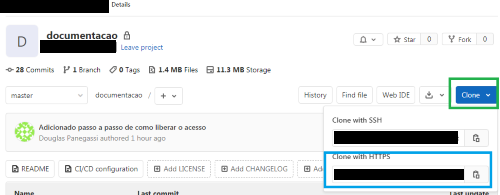
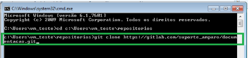
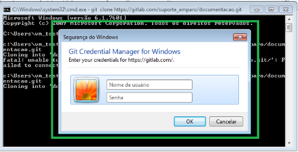
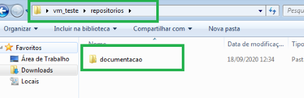
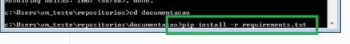
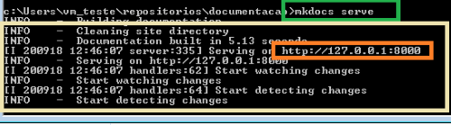
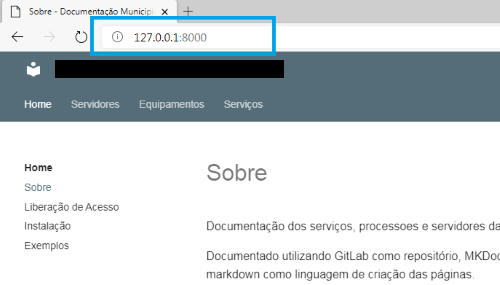
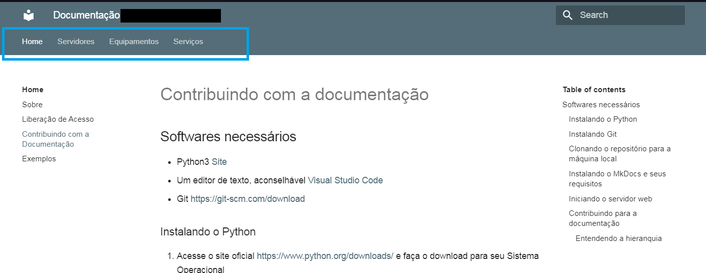
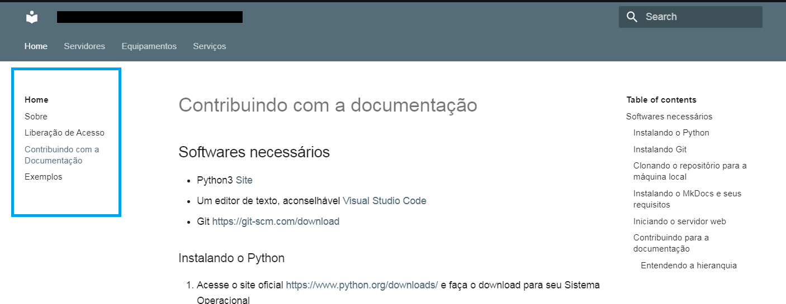
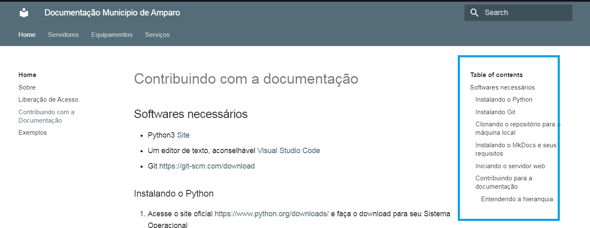

# Contribuindo com a documentação

## Softwares necessários

- Python3 [Site](https://www.python.org/downloads/)
- Um editor de texto, aconselhável [Visual Studio Code](https://code.visualstudio.com/Download)
- Git [https://git-scm.com/download](https://git-scm.com/download)

### Instalando o Python

1. Acesse o site oficial [https://www.python.org/downloads/](https://www.python.org/downloads/) e faça o download para seu Sistema Operacional
2. Na tela de instalação marque a opção **Add Python 3.X to PATH**
3. Clique em **Install Now**


### Instalando Git

1. Faça o download no site oficial [https://git-scm.com/download](https://git-scm.com/download)
2. A instalação padrão ( somente dando next ) já nos atende

### Clonando o repositório para a máquina local

1. Acesse sua conta do [GitLab](https://gitlab.com)
2. Clique no repositório que deseja clonar, ex.:Suporte Amparo/documentação
3. Clique no icone azul **Clone**
4. Copie o link da parte **Clone With HTTPS**
 

5. Crie uma pasta para armazenar seus repositórios. ex.: c:\user\usuario\repositorios

    !!! tip "Dica"
        A questão de criar um diretório chamado repositório na raiz do usuário é para facilitar no caso de ter mais dem um repositório e você querer que eles fiquem no mesmo local para facilitar a localização

6. Abra **CMD** e navegue até a pasta onde irá fazer o clone do repositório, ex.: `cd c:\Users\vm_teste\repositorios`
7. Usaremos o **git clone** para fazer o clone do repositório para a máquina local

    `git clone <link_do_repositorio>`
    Ex.: `git clone https://gitlab.com/suporte_amparo/documentacao.git`

    

8. Será solicitado seu usuário e senha do GitLab



9. Após finalizar o processo do git clone será criada uma pasta com o nome do repositório



### Instalando o MkDocs e seus requisitos

O MkDocs é um conjunto de ferramentas para desenvolver a documentação usando Markdown, ele gera o código HMTL dado o conteúdo do arquivo de markdown e tem um servidor Web embarcado para que você possa testar as alterações em sua máquina antes de subir para o repositório as alterações que você realizou

1. Via **CMD** acesse a pasta do repositório, ex.: `cd c:\Users\vm_teste\repositorios\documentacao`
2. Digite o comando `pip install -r requirements.txt`

    !!! tip "Entendo o comando acima"
        **pip** vem na instalação do Python, ele é como um gerenciador de pacotes do linux

        Dentro de **requirements.txt** tem os pacotes que são necessários para o MkDocks, assim como algumas extensões para adicionar novas funcionalidades para o Makdown



### Iniciando o servidor web

Para poder visualizar no navegador o site gerado pelo markdown é necessário iniciar o servidor do mkdocs

1. Via **CMD** acesse a pasta do repositório, ex.: `cd c:\Users\vm_teste\repositorios\documentacao`
2. Inicie o servidor web com o comando `mkdocs serve`



3. Acesse o link `http://127.0.0.1:8000` no navegador para visualizar a página



### Entendendo da estrutura e contribuindo

#### Entendendo a Hierarquia

A criação dos menus de navegação são criada pelo **mkdoks.yml**

Trecho do arquivo:

``` linenums="1"
# Árvore de Páginas
nav:
  - Home:
    - Sobre: index.md
    - Liberação de Acesso: acesso.md
    - Contribuindo com a Documentação: instalacao.md
    - Exemplos: exemplos.md
  - Servidores:
    - Sobre: servidores/servidores.md
    - E-Sus: servidores/esus/esus.md
    - Laboratório: servidores/laboratorio/laboratorio.md
  - Equipamentos:
    - Sobre: equipamentos/equipamentos.md
    - Mikrotik: equipamentos/mikrotik.md
  - Serviços:
    - G-Suit: servicos/gsuit.md
```

O primeiro nível (Home, Servidores, Equipamentos, Serviços) são os menus do **Header** da página



Já o que está no segundo nível, como por exemplo de Home (Sobre, Liberação de Acesso, Contribuindo com a Documentação, Exemplos) ficam localizados no menu a esquerda



E a direita fica o menu de navegação do arquivo **.mk** em questão, por exemplo, se você acessar Home >  Contribuindo com a Documentação, o menu a direita será os links para navegar nesta documentação


